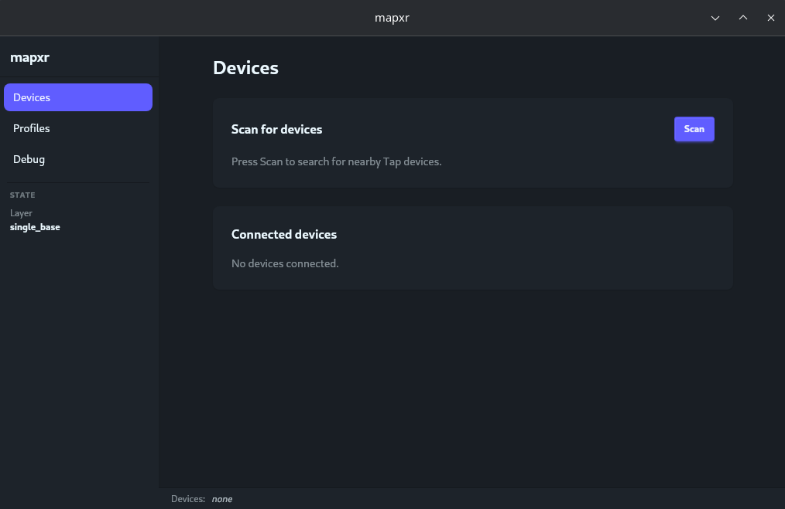

# MapXr

**MapXr** is what I always wished the Tap Strap and TapXr to be — a highly customisable, local-first remapper that supports **two Tap devices simultaneously**.



Map any finger tap to keyboard shortcuts, macros, mouse clicks, app-specific profiles, and more — no internet connection, no account, no subscription. One device gives you 31 unique single-tap chords. With two devices across both hands, that grows to **1023** — enough that you'll never need finicky double or triple taps.

---

## Download

**[→ Get the latest release](https://github.com/halfmonty/mapxr/releases)**

| Platform | Installer |
| -------- | --------- |
| Windows | `mapxr_x.y.z_x64-setup.exe` |
| Linux (Fedora / RHEL) | `mapxr_x.y.z_x86_64.rpm` |
| Linux (Ubuntu / Debian) | `mapxr_x.y.z_amd64.deb` |
| Linux (universal) | `mapxr_x.y.z_amd64.AppImage` |

> **Windows:** SmartScreen may warn on first launch. Click **More info → Run anyway**. This clears as the app builds download reputation.
>
> **Linux on NVIDIA + Wayland:** if the AppImage crashes, use the RPM or DEB instead — it uses your system's WebKit and avoids the driver conflict.

---

## Documentation

Full documentation, guides, and the devlog are on the project site:

**[halfmonty.github.io/MapXr](https://halfmonty.github.io/MapXr/)**

---

## Building from source

```bash
cd apps/desktop
npm install
npm run tauri dev     # dev mode with hot reload
npm run tauri build   # production build
```

Requires Rust stable and Node 20+.

---

MapXr is a personal project and is not affiliated with or endorsed by [Tap Systems Inc.](https://www.tapwithus.com/)
